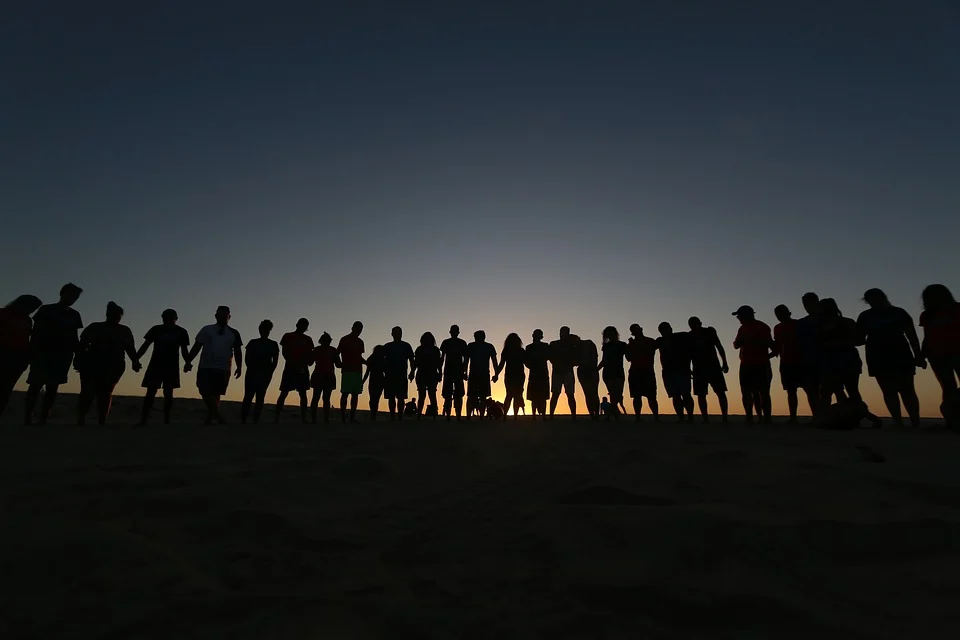

## The Community

BDSM is a community first and foremost, with its own expectations, rules & limits that we entrust with each other. It is far more meaningful than a tag in PornHub, admittedly long ago this was my view about BDSM until I met someone who taught me there is so much more to BDSM. The BDSM Community has an intense focus on promoting and ensuring safety with each other. Often local gatherings, sites, and online communities like ours exist to promote a safer exploration into BDSM for others, as well as a way to meet others safely. If you ever sought out your local community, you will see a wide array of rules and expectations to participate in events. Local gatherings often work through vouches and other means to foster a safe and discrete community. Alternatively, there are many great public events you can join through fetlife.com that can open more doors to private gatherings through the connections you make along the way in the community.

## To Be In A Dynamic

BDSM dynamics are something meaningful, and they are to be taken seriously. If you're a serial abuser, cheater, or an overall shitty person, expect to be ostracized by those in your local community, or in communities like ours. Therefore, always follow rules, put your best foot forward and raise others up by educating them, so we are all rise together as a BDSM community.

## How can I tell who is in the community?

In the last decade, BDSM has become mainstream. It's now hard to tell if a person's interests in BDSM is superficial and inspired by porn/movies, or if they are serious. You will come across people who lack understanding of what BDSM is (especially people under 30). Others can fall into a gray area where they say they are into BDSM, because it's trendy and attractive. These are people you often want to avoid.

Forming dynamics with people like these is not a dealbreaker, but helping a person explore is a serious commitment. BDSM is something that takes years of self discovery and experimenting. That person may find their path does not align with your path. It's not uncommon for things to fall apart with so much uncertainty. In the same vein, it can be rewarding seeing the growth of a partner. I recommend staying away from these dynamics, unless you like helping/teaching, as you will be disappointed if you have high expectations from the get-go.

The best place to find partners interested in BDSM is in communities like ours or local gather events (found on fetlife.com). Relying on main-stream sources ways like Tinder, POF, Bumble etc.. Can be a wild card of toxicity or gems that may work or not depending on what you strive to achieve within BDSM. If you want something common like maso/sado relationship that is relative common to find, and you can achieve that with enough searching on apps like Tinder. If you are more about a lifestyle kink like DDLG, Gorean or kinks that seeking those online connections may be effort to find a similar mind. Lastly, places like Reddit have hyper-focused communities for every kink you could imagine if you struggle to find people who share your interests.

## The most important factor

The sign someone respects BDSM (and potentially you) is if they sought to educate themselves about BDSM and safety for the kinks they enjoy. Many say they are into BDSM and are unable to answer basic safety concepts or questions about BDSM, or what their kinks mean to them. Sometimes playing the "I know it all card" or otherwise hyping up their superficial knowledge and disregarding criticism. If someone has sought out BDSM education, they are likely involved in the community and that is a great sign they are serious.

## Who decides the rules?

In local events like dungeons, there are people called Dungeons Monitors. These people take the form of a staff figure who moderates events and ensures everyone is safe when being kinky. If they see unsafe behaviors, or if rules are being broken (such as drug use) they stop your scene and may kick you out depending. Rules can vary from place, safety is important and many have strict no substance rules, even alcohol. Dungeon Monitors typically take their role quite seriously, if something were to happen it is their responsibility. If they tell you to stop, you stop. Their authority is absolute, and it's not to be questioned even if you disagree, their house, their rules. Small mistakes happen and if you screw up something you listen and learn. Dungeon Monitors usually have significant experience and are a good way to ask about rules, kink safety, or protocol if you are unsure about something new to you. Dungeon Masters are the last role you may find in your local community. It denotes the person who owns or manages the event, usually in charge of the Dungeon Monitors (maybe one themselves in practice too).

In online communities, or the "internet" the definition and expectations are far more complicated. It's often best to stick to yourself